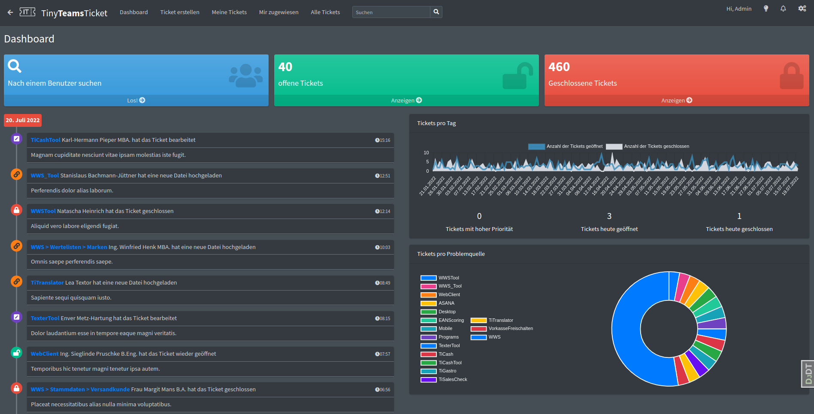
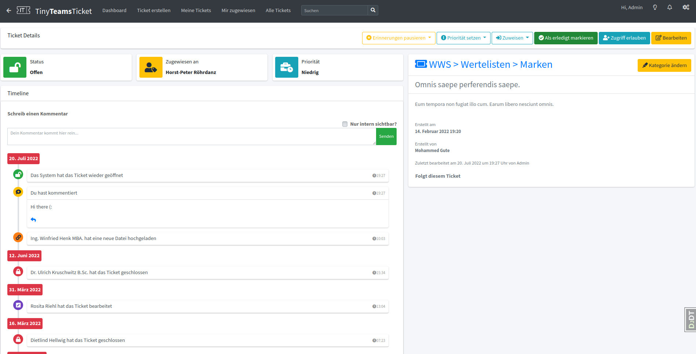
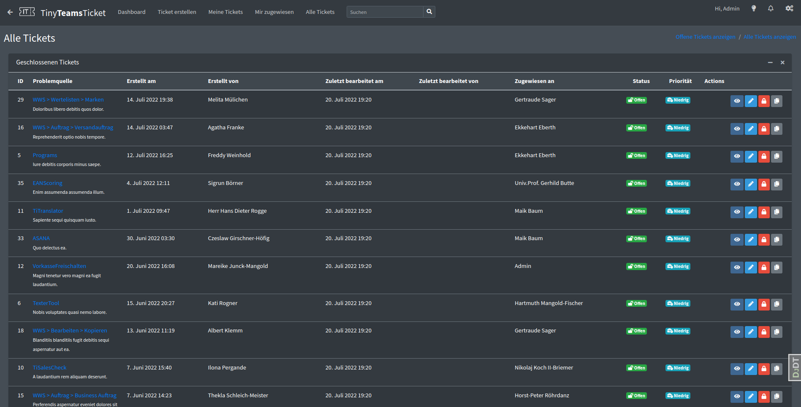

# TinyTeamsTicket
An extremely simple IT ticketing system adapted for small and medium sized companies with easy integration 
into Microsoft Teams and Azure Active Directory authentication.

This project was part of my master's thesis and is no longer maintained, but anyone is free to use it,
abuse it, and modify it as they please.  Feel free to contact me at eddie.livengood@gmail.com with
any questions.

The entire app is in German, but I would like to internationalize it at some point.

## App Preview
### Employee Dashboard (in dark mode)


### Ticket Detail (in light mode)


### Ticket List (in dark mode)


## Dev Environment

### Requirements
- Python >= 3.6
- [pip](https://pip.pypa.io/en/stable/) Package Installer for Python
- [venv](https://docs.python.org/3/tutorial/venv.html) Virtual Environment

### Install Packages and Start Server

With an active virtual environment, the following command can be used to quickly
start the app with some testing data available.  You can then use the username
`admin` and the password `admin` at [localhost:8000](http://localhost:8000/) to login.

```bash
python manage.py quickstart
```
...or step by step:

1. Install packages
```bash
pip install -r requirements/dev-requirements.txt
```
2. Migrate the SQLite DB
```bash
python manage.py migrate
```
4. Create a superuser (follow prompts)
```bash
python manage.py createsuperuser
```
5. Create example data
```bash
python manage.py loaddata data_fixtures
```
6. Start the server
```bash
python manage.py runserver
```


### Tech-Stack
#### Backend
1. [Python 3](https://www.python.org/about/)
2. [Django](https://www.djangoproject.com/)
3. [Docker](https://www.docker.com/) & [Docker-Compose](https://docs.docker.com/compose/)
   - Database: [Postgres](https://www.postgresql.org/)
   - File Server & Proxy: [Nginx](https://www.nginx.com/)
   - WSGI HTTP Server: [Gunicorn](https://gunicorn.org/)
   - Background Cronjobs: [Huey](https://huey.readthedocs.io/en/1.11.0/)
   - Background Tasks: [django-background-tasks](https://django-background-tasks.readthedocs.io/en/latest/)
   
#### Frontend
1. [Javascript](https://developer.mozilla.org/en-US/docs/Web/JavaScript) & [Jquery](https://jquery.com/)
2. [AdminLTE 3](https://adminlte.io/docs/3.1/)


## Features

### [Microsoft Single-Sign-On Authentication](https://docs.microsoft.com/en-us/azure/active-directory/manage-apps/what-is-single-sign-on)
For easy integration with a Microsoft account, single sign-on authentication has been implemented.
has been implemented. You can select **Log in with Microsoft** on the login page and follow the instructions.
follow. There are a few advantages to this:
1. there is no need to remember an additional password or create an account
2. the ticket system gets access to the Microsoft data and automatically pulls out the name, 
   e-mail address and API token. With the API token you can retrieve, modify, delete or access data from [Microsoft Graph API](https://docs.microsoft.com/en-us/graph/overview).
   change, delete or send data. 
SSO authentication simplifies integration with Microsoft products, such as Teams.

For users outside the domain, a normal user with credentials can be created.

### Hierarchical problem sources
To create a ticket, the user must select a problem source. Additionally
a problem source also have many subproblem sources, which also have subproblem sources and so on.

Problem sources can always be expanded. For example, if IT gets many tickets regarding problem X,
but problem X is very complicated or unspecific, IT can create sub-problems so that the user has
to describe more precisely what the problem is without having to describe much more in writing.

The idea is that the user doesn't need to describe exactly where the problem occurred
and that IT has a better overview of what the problem is. The feature is a kind of semi-automatic 
categorization and it allows for improved analysis of problems while easing the burden on normal 
and IT users.

The hierarchical problem sources were implemented by [Django-MPTT Middleware](https://django-mptt.readthedocs.io/en/latest/)
implemented. A problem source can have *0..1* parent problem source and *0..n* child problem sources.

### Microsoft Teams Integration
It has a `manifest.json` file that can be used to install the system as an app in Microsoft Teams.
This creates easy access to the ticket system and allows notifications to be sent directly through Teams.
More can be found [here](https://docs.microsoft.com/en-us/microsoftteams/platform/resources/schema/manifest-schema).

The app can be registered with Azure Active Directory as part of the company app catalog and is therefore only installable internally.  

### Ticket and Event Timeline
A ticket detail page shows the user the progress of the ticket
or status (open or closed), the person responsible, all details and comments about the ticket and so
so on.

On the main page or so-called dashboard, the user sees the entire chronological history of all tickets.